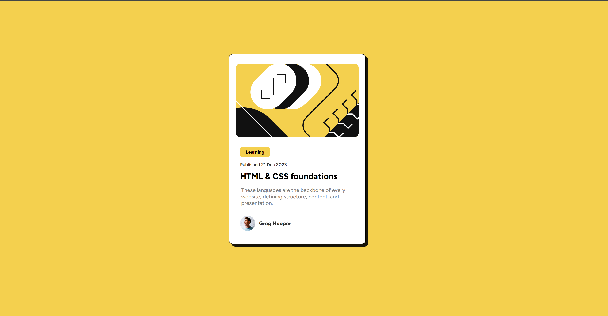
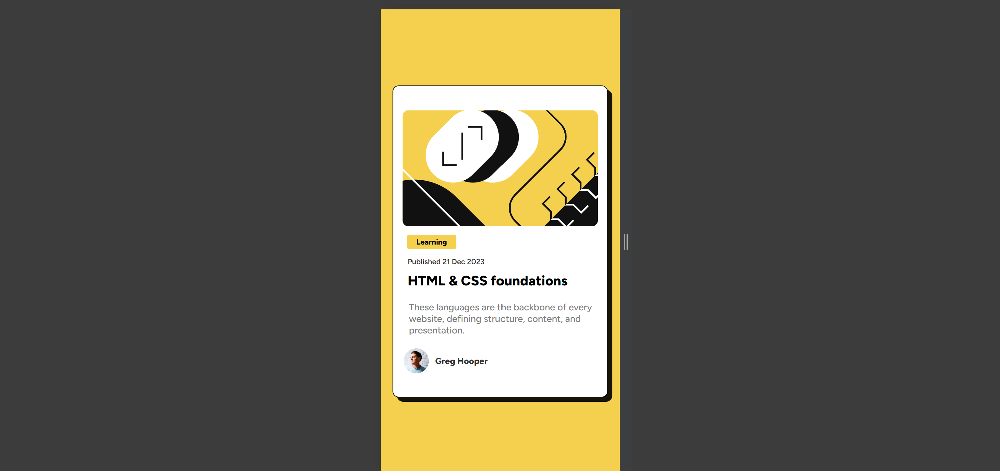

# Blog Preview Card

## Description

The **Blog Preview Card** is a visually appealing component designed to showcase a blog post preview. This project features an HTML and CSS-based card that highlights a blog post's category, publish date, title, description, and author information. The design is responsive, making it suitable for various screen sizes.

This project was created as part of a Frontend Mentor challenge. You can view the **live demo [here](https://blog-preview-card-solution-01.netlify.app/)** and access the **challenge details [here](https://www.frontendmentor.io/challenges/blog-preview-card-ckPaj01IcS)**.

## Features

- Responsive design that adapts to different screen sizes.
- Hover effect for the card that scales and adjusts the shadow.
- Clear and modern design using HTML & CSS.

## Visuals

 
 

## Installation

To get started with this project, clone the repository and open the `index.html` file in your browser:

```bash
git clone https://gitlab.com/Yashi-Singh-9/blog-preview-card.git
cd blog-preview-card
```

You can then open `index.html` in your preferred web browser to see the card in action.

## Support

If you encounter any issues or have questions, please open an issue in the GitLab repository or reach out to [LinkedIn](www.linkedin.com/in/yashi-singh-b4143a246).

## Roadmap

Future updates may include:
- Enhanced accessibility features.
- Integration with JavaScript for dynamic content.

## Contributing

Contributions are welcome! If you'd like to improve this project, please follow these steps:

1. Fork the repository.
2. Create a new branch for your feature or bug fix.
3. Submit a pull request with a clear description of your changes.

Please ensure that your code follows the existing style and includes appropriate tests.

## Authors and Acknowledgments

- **Yashi Singh** – Project creator and maintainer.

Special thanks to [Frontend Mentor](https://www.frontendmentor.io) for providing the challenge and inspiration for this project.

## License

This project is licensed under the [MIT License](LICENSE).

## Project Status

This project is currently maintained. Contributions and feedback are welcome.